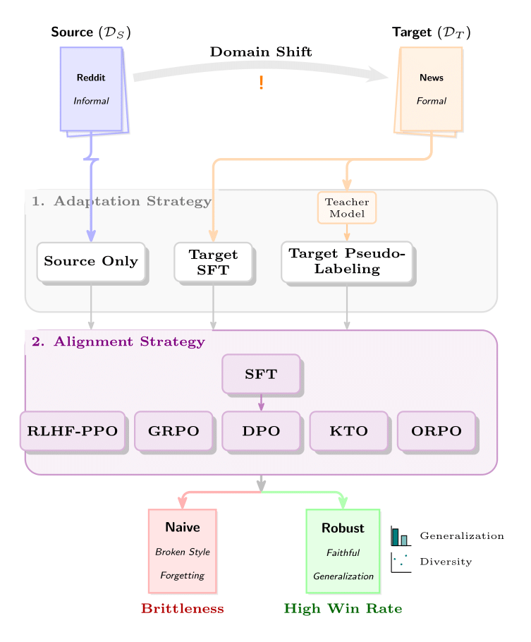

# An Empirical Study on Preference Tuning Generalization and Diversity Under Domain Shift

This is a repository for the paper "An Empirical Study on Preference Tuning Generalization and Diversity Under Domain Shift".




This repository contains the code and configuration templates used to evaluate preference tuning methods under domain shift, with a focus on generalization and output diversity across alignment objectives and adaptation strategies.

## What’s in here

We support training and evaluation for:
- Supervised Fine-Tuning (SFT)
- Direct Preference Optimization (DPO)
- Kahneman–Tversky Optimization (KTO)
- Odds Ratio Preference Optimization (ORPO)
- Reward Modeling (RM)
- PPO and GRPO RL fine-tuning (PPO / GRPO)

We evaluate:
- **In-domain vs out-of-domain generalization**
- **Output diversity** using a fixed generation protocol and multiple diversity metrics


## Repository layout

- `prefadap/`: core package (training, evaluation, data, and CLI utilities)
- `configs/`: configuration templates and defaults

## Setup

- Python 3.10+
- Install dependencies:

```bash
pip install -r requirements.txt
```

## Training runs

Training is driven by YAML configs and dispatched via the training CLI. Start
from the templates in `configs/templates/` and add the required fields for your
run (for example: `model_name_or_path`, `dataset_name`, and `output_dir`). The
config loader supports `extends` to compose templates.

Run training with:

```bash
python -m prefadap.cli.run_training <pipeline> --config path/to/config.yaml
```

### SFT

```yaml
# configs/local/sft_cnndm.yaml
extends:
  - configs/templates/sft_standard.yaml
model_name_or_path: <hf-model-or-local-path>
dataset_name: cnndm
output_dir: runs/sft_cnndm
```

```bash
python -m prefadap.cli.run_training sft --config configs/local/sft_cnndm.yaml
```

### DPO

```yaml
# configs/local/dpo_run.yaml
extends:
  - configs/templates/dpo_standard.yaml
model_name_or_path: <hf-model-or-local-path>
dataset_name: tldr  # or pseudo_cnndm
output_dir: runs/dpo_run
# Required when using pseudo_* datasets
pseudo_data_path: data/pseudo_cnndm.jsonl
```

```bash
python -m prefadap.cli.run_training dpo --config configs/local/dpo_run.yaml
```

### KTO

```yaml
# configs/local/kto_run.yaml
extends:
  - configs/templates/kto_standard.yaml
model_name_or_path: <hf-model-or-local-path>
dataset_name: askengineers
output_dir: runs/kto_run
```

```bash
python -m prefadap.cli.run_training kto --config configs/local/kto_run.yaml
```

### ORPO

```yaml
# configs/local/orpo_run.yaml
extends:
  - configs/templates/orpo_standard.yaml
model_name_or_path: <hf-model-or-local-path>
dataset_name: pseudo_cnndm  # or another preference dataset
output_dir: runs/orpo_run
pseudo_data_path: data/pseudo_cnndm.jsonl
```

```bash
python -m prefadap.cli.run_training orpo --config configs/local/orpo_run.yaml
```

### RM

```yaml
# configs/local/rm_run.yaml
extends:
  - configs/templates/rm_standard.yaml
model_name_or_path: <hf-model-or-local-path>
dataset_name: pseudo_cnndm
output_dir: runs/rm_run
```

```bash
python -m prefadap.cli.run_training rm --config configs/local/rm_run.yaml
```

### PPO

```yaml
# configs/local/ppo_run.yaml
extends:
  - configs/templates/ppo_standard.yaml
model_name_or_path: <hf-model-or-local-path>
reward_model_name_or_path: <reward-model-path>
dataset_name: cnndm
output_dir: runs/ppo_run
```

```bash
python -m prefadap.cli.run_training ppo --config configs/local/ppo_run.yaml
```

### GRPO

```yaml
# configs/local/grpo_run.yaml
extends:
  - configs/templates/grpo_standard.yaml
model_name_or_path: <hf-model-or-local-path>
reward_model_name_or_path: <reward-model-path>
dataset_name: cnndm
output_dir: runs/grpo_run
rl:
  grpo:
    num_generations: 4
    max_completion_length: 256
    beta: 0.1
    epsilon: 0.2
    scale_rewards: group
```

```bash
python -m prefadap.cli.run_training grpo --config configs/local/grpo_run.yaml
```

For multi-GPU PPO/GRPO runs, launch with Accelerate (and a DeepSpeed config) and
replace the module/args accordingly.

## Generation and diversity evaluation

Generations for diversity evaluation are produced with `prefadap.cli.generate`
(see `python -m prefadap.cli.generate --help`). Diversity metrics follow the
protocol defaults in `configs/diversity/diversity_protocol.yaml` and can be run
with:

```bash
python -m prefadap.cli.evaluate_diversity <outputs_dir> --help
```

## Pseudolabeling (CNNDM)

The pseudolabeler expects a JSONL file with `prompt` and `chosen` fields. The
snippet below converts CNN/DailyMail into that format and then generates
pseudo-preference pairs in DPO format.

```bash
python - <<'PY'
from pathlib import Path
import json
from datasets import load_dataset
from prefadap.data.summarisation import make_input_example_cnndm

out = Path("data/cnndm_prompts.jsonl")
out.parent.mkdir(parents=True, exist_ok=True)
ds = load_dataset("cnn_dailymail", "3.0.0", split="train")

with out.open("w", encoding="utf-8") as f:
    for ex in ds:
        record = {
            "prompt": make_input_example_cnndm(ex["article"]),
            "chosen": ex["highlights"],
        }
        f.write(json.dumps(record) + "\n")
print(f"Wrote {out}")
PY
```

```bash
python - <<'PY'
from pathlib import Path
from prefadap.pseudo_label.techniques import (
    GenerativePreferencePseudolabeler,
    PseudolabelConfig,
)

cfg = PseudolabelConfig(
    run_id="cnndm_pseudo",
    dataset=Path("data/cnndm_prompts.jsonl"),
    output_format="dpo",
    model_type="vllm",  # or "gemini"
    model_name="meta-llama/Meta-Llama-3-8B-Instruct",
    k=2,
)

GenerativePreferencePseudolabeler(cfg).run(Path("data/pseudo_cnndm.jsonl"))
PY
```

Use the resulting `data/pseudo_cnndm.jsonl` in DPO/ORPO/RM runs via
`pseudo_data_path` or `PSEUDO_DATA_PATH`, and set `dataset_name` to
`pseudo_cnndm`.
